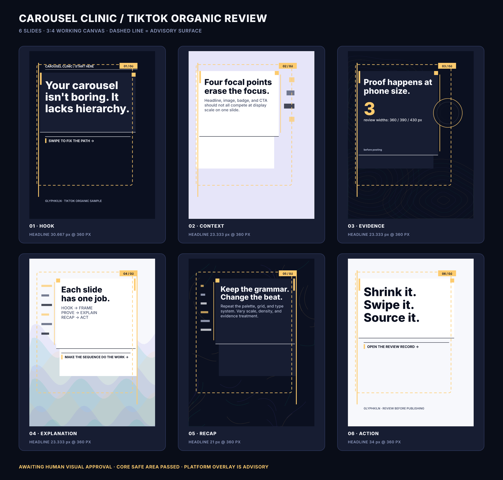

# Carousel design review sample

**Status:** Awaiting human visual approval

**Delivery profile:** `tiktok-organic-photo`

**Template:** `tiktok-carousel-slide@1.0.4`

**Format:** 1080 × 1440 Glyphkiln working canvas

## Review intent

This six-slide sample demonstrates a hook-to-action reading path, stable brand
grammar, phone-size type proof, explicit source notes, publisher-ready alt text,
and a dated advisory TikTok surface overlay. It makes no engagement promise and
does not claim that 3:4 is an official universal TikTok requirement.

| Slide | Narrative role | Render                                | Source document                           |
| ----: | -------------- | ------------------------------------- | ----------------------------------------- |
|     1 | `hook`         | [PNG](generated/outputs/slide-01.png) | [Design](generated/designs/slide-01.json) |
|     2 | `context`      | [PNG](generated/outputs/slide-02.png) | [Design](generated/designs/slide-02.json) |
|     3 | `evidence`     | [PNG](generated/outputs/slide-03.png) | [Design](generated/designs/slide-03.json) |
|     4 | `explanation`  | [PNG](generated/outputs/slide-04.png) | [Design](generated/designs/slide-04.json) |
|     5 | `recap`        | [PNG](generated/outputs/slide-05.png) | [Design](generated/designs/slide-05.json) |
|     6 | `action`       | [PNG](generated/outputs/slide-06.png) | [Design](generated/designs/slide-06.json) |

## Review records

- [Sequence review](generated/sequence-review.json)
- [Delivery sidecar](generated/delivery-sidecar.json)
- [Publishing copy and per-image alt text](generated/publishing-copy.json)
- [Complete render and device-proof record](generated/review-record.json)

The sequence has no blocking review errors. It intentionally retains one
`COMPOSITION_RHYTHM_REVIEW` warning because the registered template currently
offers one composition metadata identifier. Within that contract, the sample
uses content-responsive field alignment, alternating density, a statistic slide,
three deterministic pattern rails, and a quiet closing slide to create rhythm.

Whitespace is treated as a pacing tool, not an automatic defect: each retained
open area now supports one dominant reading path or makes room for a deliberate
pattern interrupt. The slide-number badge remains on every slide for orientation;
the header appears only on the opener, and the brand footer bookends the sequence.

Regenerate with `npm run sample:carousel` and verify exact bytes with
`npm run sample:carousel:verify`.
