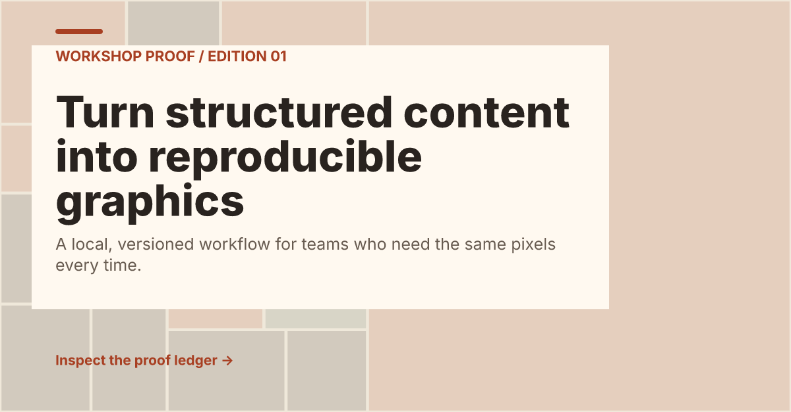

# Glyphkiln style showcase

This small consumer project turns one inert JSON design document into exact SVG,
PNG, and provenance outputs through the public `@glyphkiln/core` API.



## What it demonstrates

- strict schema validation before rendering;
- text-layout inspection and a zero-quality-issue gate;
- a warm industrial-editorial brand snapshot;
- a seeded `recursive-subdivision@1.1.0` background;
- exact-byte verification with a fixed manifest timestamp; and
- no network access, dynamic code execution, or external assets.

The graphic uses `product-announcement@1.1.1` at 1200 × 627. Its source is
[`designs/kiln-ledger.json`](designs/kiln-ledger.json), while
[`scripts/render.mjs`](scripts/render.mjs) contains the complete rendering
workflow.

## Run it

Install and build from the repository root, then generate or verify the
showcase:

```bash
npm ci
npm run build --workspace @glyphkiln/core
npm run render --workspace @glyphkiln/example-style-showcase
npm run verify --workspace @glyphkiln/example-style-showcase
```

The root `npm run examples:generate` and `npm run examples:verify` commands also
include this project.

Edit only the design JSON to try a new seed, palette, copy, format, template, or
procedural style. The render script deliberately treats that input as data and
imports only documented package exports.
